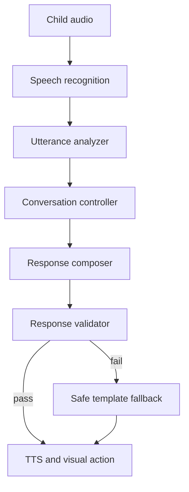

# Conversation Engine 명세 v1.0

## 1. 처리 파이프라인



LLM은 `Response composer`에만 사용한다. Controller의 action, 허용 어휘, 기대 출력, 시각 행동을 변경할 권한이 없다.

## 2. 상태

```ts
type ConversationState = {
  sessionId: string;
  phase: 'HELLO' | 'WARM_UP' | 'CORE_A' | 'PLAY' | 'CORE_B' | 'RECALL' | 'WRAP_UP' | 'ENDED';
  inputLevel: 1 | 2 | 3;
  outputLevel: 1 | 2 | 3;
  supportLevel: 0 | 1 | 2 | 3;
  interactionState: 'ACTIVE' | 'HESITANT' | 'STRUGGLING' | 'DISENGAGING' | 'STOP_REQUESTED';
  currentTopic: string;
  topicTurnCount: number;
  targetPatterns: string[];
  recentTurns: TurnSummary[];
  shortAnswerStreak: number;
  helpRequestCount: number;
  repairAttemptForPrompt: 0 | 1;
  shadowPromptCount: number;
  turnsSinceShadowPrompt: number;
  sessionElapsedMs: number;
  childTurnCount: number;
  lastAction: ActionType | null;
};
```

## 3. 발화 분석 결과

Analyzer는 사실과 추론을 분리한다.

```ts
type UtteranceAnalysis = {
  transcript: string | null;
  sttConfidence: number | null;
  language: 'ENGLISH' | 'MIXED' | 'KOREAN' | 'UNCLEAR' | 'SILENCE';
  answerForm: 'YES_NO' | 'SINGLE_WORD' | 'CHUNK' | 'SHORT_SENTENCE' | 'LONG' | 'STRUGGLE' | 'REFUSAL' | 'STOP' | 'OTHER';
  semanticIntent: string | null;
  semanticSlots: Record<string, string>;
  comprehension: 'MATCH' | 'PARTIAL' | 'MISMATCH' | 'UNKNOWN';
  spontaneity: 'SPONTANEOUS' | 'HINTED' | 'MODELED' | 'NOT_APPLICABLE' | 'UNKNOWN';
  safety: 'SAFE' | 'SENSITIVE' | 'URGENT';
  confidence: number;
  reasonCodes: string[];
};
```

`KOREAN + MATCH`는 이해 성공이다. `MIXED + MATCH`도 난이도 하락 사유가 아니다.

## 4. Action 모델

응답은 단일 Action이 아니라 구성 요소다.

```ts
type ResponsePlan = {
  priority: number;
  acknowledge: boolean;
  coreAction: ActionType;
  supportAction?: 'SHOW_TEXT' | 'SHOW_CHOICES' | 'HINT_KO';
  visualAction?: string;
  targetPattern?: string;
  allowedWords: string[];
  expectedChildResponse: 'YES_NO' | 'WORD' | 'CHUNK' | 'SENTENCE' | 'ACTION' | 'NONE';
  reasonCodes: string[];
};
```

ActionType:

- `SAFETY_HANDOFF`
- `STOP_AND_CLOSE`
- `WRAP_UP`
- `REPAIR_CONFIRM`
- `REPAIR_SIMPLIFY`
- `HINT_AND_REASK`
- `ENGAGEMENT_RECOVERY`
- `RESPOND_TO_CHILD`
- `MODEL_PATTERN`
- `COMPLETE_PATTERN`
- `OPTIONAL_SHADOW`
- `ASK_YES_NO`
- `ASK_CHOICE`
- `ASK_WORD`
- `ASK_SHORT_SENTENCE`
- `PLAY_ACTION`
- `CHANGE_TOPIC`

## 5. 결정 우선순위

한 턴에 여러 규칙이 참이면 가장 위 규칙 하나가 `coreAction`을 결정한다.

1. `safety == URGENT` → `SAFETY_HANDOFF`
2. `answerForm == STOP` 또는 `interactionState == STOP_REQUESTED` → `STOP_AND_CLOSE`
3. 종료 시간이 지남 → `WRAP_UP`
4. STT/의미 불확실 → Repair 규칙
5. 이해 실패 → 지원 증가 및 질문 단순화
6. 참여 저하 → `ENGAGEMENT_RECOVERY`
7. 아이의 자발적 이야기/질문 → `RESPOND_TO_CHILD`
8. 목표 Pattern 연습 기회 → 모델링 또는 완성
9. 안정적 성공 누적 → 단계 상승 후보
10. 주제 턴 초과 → `CHANGE_TOPIC`
11. 기본 다음 질문

## 6. Repair 규칙

### 판정

다음 중 하나면 불확실 발화다.

- `sttConfidence < 0.55`
- `comprehension == MISMATCH`이고 현재 선택지·known words와도 불일치
- `language == UNCLEAR`

### 처리

- 현재 prompt의 repair가 0회면 `REPAIR_CONFIRM` 또는 `REPAIR_SIMPLIFY`
- 이미 1회면 다시 말하기를 요청하지 않고 2개 선택지로 전환
- repair 카운트는 새 prompt로 이동하면 0으로 초기화

확인 후보는 STT 신뢰도와 문맥 후보 점수가 모두 기준 이상일 때만 말한다. 그렇지 않으면 후보를 추측하지 않는다.

## 7. 이해 실패와 영어 출력 실패

| 분석 | 상태 변화 | 다음 행동 |
|---|---|---|
| `KOREAN + MATCH` | input 유지, output 유지 또는 1단계 지원 | 영어 모델링 후 쉬운 발화 초대 |
| `MIXED + MATCH` | 수준 유지 | 빠진 영어 단어를 자연스럽게 모델링 |
| `ENGLISH + MATCH` | 성공 누적 | 대화 진행 |
| `MISMATCH` | input -1 후보, support +1 | 선택 질문 |
| `STRUGGLE` | support +1 | 한국어 힌트 또는 그림 선택 |
| `REFUSAL` | 난이도 평가 금지 | 요구 취소, 놀이 반응 또는 주제 변경 |

## 8. 단계 조정

최근 4개 유도 턴 중 3개 이상이 `MATCH`, 평균 응답 3초 이하, help/repair 0회일 때 한 축만 올릴 수 있다.

- 한 번에 한 축만 변경
- 우선순위: support 감소 → output 증가 → input 증가
- 상승 후 최소 3턴 동안 추가 상승 금지

즉시 하락하지 않고 먼저 support를 높인다. 단 `뭐?`, `모르겠어`, 연속 침묵이면 해당 prompt를 바로 쉽게 바꾼다.

## 9. 단답 확장 정책

확장은 아래 조건을 모두 만족할 때만 가능하다.

- 단답이 목표 패턴에 자연스럽게 들어감
- 최근 3턴 내 따라 말하기 요청 없음
- interaction state가 `ACTIVE` 또는 `HESITANT`
- 같은 목표 표현을 이번 세션에서 강제 연습하지 않음

선호 순서:

1. 모델링만: `Cat! You like cats!`
2. 문장 시작 제공: `I like...`
3. 선택적 따라 말하기: `Can you say, “I like cats”?`

따라 말하기는 세션 최대 3회, 연속 금지, 거절 후 5턴간 금지다.

## 10. 침묵

- 0~4초: 기다림
- 약 5초: 영어 선택지를 짧게 반복하고 그림 표시
- 추가 4초: 한국어 힌트 + 같은 선택지
- 추가 침묵: 실패 처리 없이 다른 놀이 질문 또는 주제 변경

타이머는 TTS 재생 완료 시점부터 시작한다.

## 11. Topic 정책

- 한 주제에서 기본 4~8 child turns
- 분기는 topic graph에 정의된 edge만 사용
- topic graph 밖의 연상 이동 금지
- 아이가 자발적으로 다른 안전 주제를 명확히 제시하면 허용 목록 안에서 전환 가능
- 목표 패턴을 다른 주제에서 회수할 때만 계획된 전환 허용

## 12. Response Validator

검사 순서:

1. 안전 금지 규칙
2. 개인정보 질문 여부
3. plan의 action/의도 일치
4. 허용 어휘 또는 허용 새 단어 수
5. 문장당 단어 수
6. 질문 수
7. 기대 응답 가능성
8. 시각 선택지와 발화 일치

기본 제한:

- 영어 한 문장 7단어 이하
- 한 응답의 질문 최대 1개
- 새 단어 최대 1개, input level 1에서는 원칙적으로 0개
- 선택지는 최대 2개
- 고유명사는 부모 등록 또는 콘텐츠 허용 목록만 사용

검증 실패 시 LLM 재생성은 1회만 한다. 다시 실패하면 검증된 템플릿 fallback을 사용한다.

## 13. 필수 Controller 테스트

1. `Cat` 단답 후 자연스러운 모델링
2. `고래밥` 한국어 의미 적합 답변을 이해 성공 처리
3. `I like 고래밥` 혼합 답변의 패턴 성공 처리
4. `Forever` 문맥 불일치 시 1회 repair
5. 두 번째 STT 실패 후 선택 질문 전환
6. `싫어` 후 따라 말하기 즉시 중단
7. `그만할래` 후 종료 외 질문 금지
8. 5초 침묵 시 그림 선택, 연속 침묵 시 주제 전환
9. 어려운 LLM 출력 차단 및 fallback
10. 종료 시점과 다른 규칙 충돌 시 wrap-up 우선

