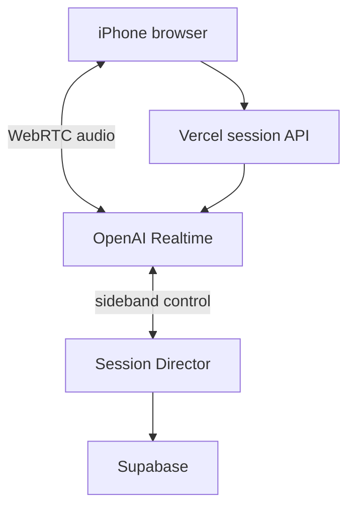

# Realtime Session Director 명세 v2.0

## 1. 아키텍처 결정

MVP는 분리형 `STT → 자체 Controller → LLM → Validator → TTS` 파이프라인을 사용하지 않는다. OpenAI Realtime speech-to-speech 모델이 실시간 음성 이해, 다음 발화 결정, 음성 생성을 한 세션 안에서 수행한다.

우리 시스템은 매 턴 응답을 앞에서 결정하지 않는다. 세션 시작 시 목표와 제약을 설정하고, 진행 중 이벤트를 관찰하며, 최소한의 도구와 instruction update로 개입하는 `Session Director` 역할을 한다.



## 2. 책임 분리

### Realtime Agent

- 아이 음성 및 한국어·영어 혼합 발화 이해
- 자연스러운 다음 발화 결정과 짧고 쉬운 음성 응답 생성
- 끼어들기와 턴테이킹 처리
- 예상 밖의 안전한 대화 처리
- instruction에 따른 힌트·단답 확장·주제 전환

### Session Director

- 아이 프로필과 오늘의 목표로 세션 instruction 생성
- 세션 시간과 단계 관리
- Realtime 이벤트와 transcript 관찰
- 아이 상태·단어·패턴 evidence 기록
- 최소 도구 실행, 안전 이벤트와 stop 요청 처리
- 세션 종료 후 부모 리포트 생성

### Client

- WebRTC 연결과 마이크·스피커 처리
- 캐릭터 상태 및 선택 이미지 표시
- 연결·발화·응답 지연 계측
- 중단, 일시정지, 종료 UX

## 3. 연결 원칙

1. 브라우저가 Vercel의 `/api/realtime/session`을 호출한다.
2. 서버가 비밀 API 키로 OpenAI Realtime 임시 세션을 생성한다.
3. 브라우저가 임시 자격 증명으로 OpenAI와 WebRTC 연결을 맺는다.
4. 오디오는 애플리케이션 서버를 통과하지 않는다.
5. 필요한 경우 서버는 동일 call id에 sideband WebSocket으로 연결한다.
6. DB 기록은 음성 응답의 critical path에서 제외한다.

## 4. Session state

```ts
type SessionState = {
  sessionId: string;
  childId: string;
  callId: string | null;
  status: 'CONNECTING' | 'ACTIVE' | 'ENDING' | 'ENDED' | 'ERROR';
  phase: 'HELLO' | 'WARM_UP' | 'PLAY_A' | 'PLAY_B' | 'RECALL' | 'WRAP_UP';
  interactionState: 'ACTIVE' | 'HESITANT' | 'STRUGGLING' | 'DISENGAGING' | 'STOP_REQUESTED';
  topics: string[];
  targetPatterns: string[];
  knownWords: string[];
  elapsedMs: number;
  childTurnCount: number;
  helpCount: number;
  repairCount: number;
  lastActivityAt: string;
};
```

이 state를 매 턴 모델에 다시 보내지 않는다. 시작 instruction에 필요한 요약만 포함하고, 목표 변경·안전·종료 개입이 필요한 경우에만 `session.update`를 사용한다.

## 5. Realtime Agent instruction

```text
You are Siha's friendly English playmate.

GOAL
Help Siha use English she already knows.
This is play, not a lesson or test.

SPEECH
- Use very easy English.
- Usually use 3 to 7 words per sentence.
- Ask only one thing at a time.
- Let Siha speak more than you.
- Speak warmly and briefly.

WHEN SIHA ANSWERS
- Accept one-word, Korean, and mixed answers.
- Do not call Korean an error.
- Model a short English phrase naturally.
- Invite repetition only sometimes, never repeatedly.

WHEN SIHA STRUGGLES
- If she says "뭐?" or "모르겠어", give one short Korean hint.
- Then offer two easy choices.
- Ask for a repeat only once.
- Never pretend you understood an uncertain word.

BOUNDARIES
- Stay in the allowed topics.
- Do not ask for private information.
- Stop immediately if she wants to stop.
```

동적 세션 정보:

```yaml
child_name: Siha
age: 7
known_words: [cat, dog, pink, blue, cookie]
topics: [animals, colors]
target_patterns: [I like ___]
session_minutes: 5
```

## 6. VAD

초기값은 `semantic_vad`다. 시하가 `K... ki... 몰라`처럼 중간에 생각할 때 단순 침묵으로 턴을 자르지 않도록 한다.

```json
{
  "type": "semantic_vad",
  "eagerness": "low",
  "create_response": true,
  "interrupt_response": true
}
```

파일럿에서는 `low`와 `auto`를 비교한다.

| 지표 | 의미 |
|---|---|
| false interruption count | 아이가 끝내기 전에 AI가 말한 횟수 |
| end-of-turn latency | 아이 말 종료부터 AI 음성 시작 |
| abandoned turn count | AI가 너무 늦어 아이가 이탈한 턴 |

## 7. MVP 도구

- `record_child_state`: 상태와 근거를 비동기 기록
- `show_choices`: 화면에 영어 선택 이미지 2개 표시
- `end_session`: 아이 요청·시간 제한·정상 종료·안전 종료 기록

모든 응답에 도구 호출을 강제하지 않는다. 도구 왕복이 음성 응답을 지연시키기 때문이다.

## 8. Sideband 개입 조건

서버는 다음 상황에만 능동 개입한다.

1. 5분 종료 또는 최대 8분 종료
2. 명시적인 stop 요청
3. 안전 이벤트
4. 같은 instruction 위반이 세션 중 반복됨
5. 부모가 세션을 종료함

일반적인 단답, 한국어 답변, topic 분기는 Realtime Agent에 맡긴다.

## 9. Guardrail 전략

음성 출력은 스트리밍되므로 모든 발화를 사전 차단할 수 있다고 가정하지 않는다.

1. 강한 instruction과 좁은 주제
2. 짧은 세션과 제한된 도구
3. Realtime 이벤트 기반 안전 감시
4. transcript 사후 평가
5. 반복되는 실제 실패만 코드 규칙으로 추가

자동 표기할 위반:

- 영어 문장 10단어 초과
- 한 응답에 질문 2개 이상
- 허용 주제 밖으로 2턴 이상 이탈
- repeat 요청 연속 사용
- 모른다고 했는데 같은 질문 반복
- 불확실 발화를 사실로 단정
- 개인정보 질문

## 10. Latency 예산

```text
speech_started_at
speech_stopped_at
response_created_at
first_audio_delta_at
audio_playback_started_at
```

```text
model_response_latency = first_audio_delta_at - speech_stopped_at
perceived_latency = audio_playback_started_at - speech_stopped_at
```

파일럿 목표는 perceived latency P50 1초 안팎, P95 2초 이하로 두되 실제 iPhone·한국 네트워크에서 측정 후 확정한다.

## 11. 필수 테스트

1. iPhone Safari WebRTC 연결
2. 일반 API 키가 브라우저에 노출되지 않음
3. 느린 발화 중 AI가 끼어들지 않음
4. 아이가 AI 음성을 끊고 말할 수 있음
5. 한국어·영어 혼합 답변이 자연스럽게 이어짐
6. `모르겠어` 후 힌트와 선택 제공
7. 불확실 발화를 단정하지 않음
8. `싫어` 후 반복 요구 중단
9. `그만할래` 후 추가 질문 없이 종료
10. 세션 종료 후 transcript와 latency 리포트 생성

