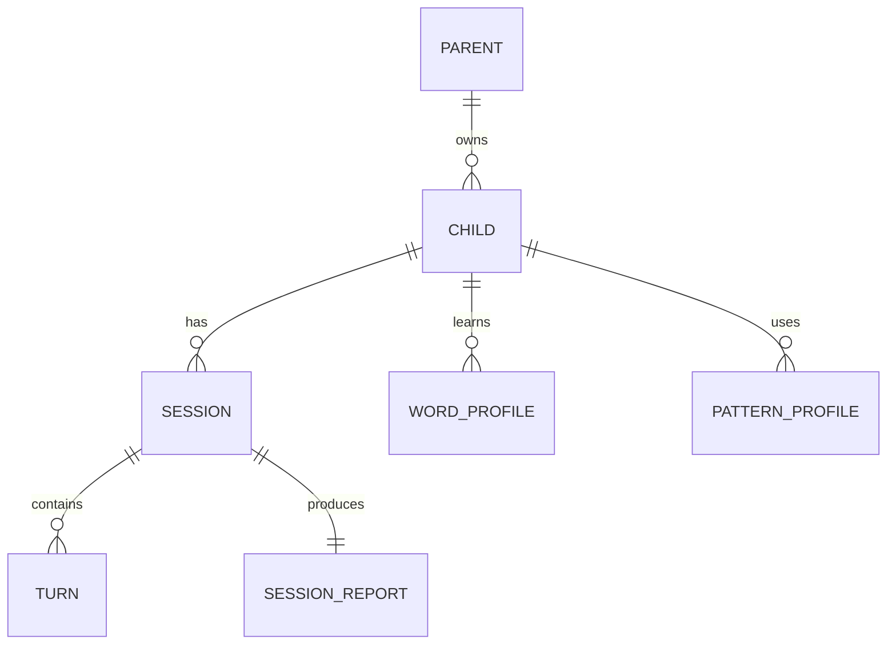

# 데이터 모델 v1.0

관계형 DB(PostgreSQL 기준)를 권장한다. 오디오 객체는 DB가 아니라 암호화된 객체 저장소에 두며 DB에는 만료 가능한 참조만 저장한다.

## 1. 핵심 관계

## 2. 테이블

### parents

| 컬럼 | 타입 | 설명 |
|---|---|---|
| id | uuid PK | 부모 ID |
| auth_user_id | text unique | 인증 시스템 ID |
| locale | text | 기본 `ko-KR` |
| created_at | timestamptz | 생성 시각 |

### children

| 컬럼 | 타입 | 설명 |
|---|---|---|
| id | uuid PK | 아이 ID |
| parent_id | uuid FK | 부모 |
| display_name_enc | bytea | 암호화된 이름 |
| birth_year | smallint nullable | 정확한 생일 대신 연도 우선 |
| receptive_level | smallint | 1~3 |
| expressive_level | smallint | 1~3 |
| preferred_support | smallint | 0~3 |
| favorite_topics | text[] | 허용 topic key |
| profile_version | integer | 낙관적 잠금 |
| created_at | timestamptz | 생성 시각 |

### consent_records

| 컬럼 | 타입 | 설명 |
|---|---|---|
| id | uuid PK | 동의 ID |
| parent_id | uuid FK | 부모 |
| child_id | uuid FK | 아이 |
| consent_type | text | AUDIO_STORAGE, TRANSCRIPT_STORAGE, MODEL_TRAINING 등 |
| granted | boolean | 동의 여부 |
| policy_version | text | 정책 버전 |
| recorded_at | timestamptz | 기록 시각 |

### sessions

| 컬럼 | 타입 | 설명 |
|---|---|---|
| id | uuid PK | 세션 ID |
| child_id | uuid FK | 아이 |
| status | text | ACTIVE, COMPLETED, STOPPED, ERROR |
| phase | text | 현재 phase |
| input_level | smallint | 세션 입력 수준 |
| output_level | smallint | 세션 출력 수준 |
| support_level | smallint | 세션 지원 수준 |
| target_patterns | text[] | 최대 2개 |
| topics | text[] | 사용 주제 |
| state_json | jsonb | 복구용 현재 상태 |
| state_version | integer | 동시성 제어 |
| started_at | timestamptz | 시작 |
| ended_at | timestamptz nullable | 종료 |

### turns

| 컬럼 | 타입 | 설명 |
|---|---|---|
| id | uuid PK | turn ID |
| session_id | uuid FK | 세션 |
| sequence_no | integer | 세션 내 순서 |
| speaker | text | CHILD, ASSISTANT, SYSTEM |
| transcript_enc | bytea nullable | 동의 시 암호화 저장 |
| language | text nullable | 발화 언어 분류 |
| answer_form | text nullable | 답변 형태 |
| comprehension | text nullable | MATCH 등 |
| spontaneity | text nullable | SPONTANEOUS 등 |
| classifier_confidence | numeric nullable | 0~1 |
| action_type | text nullable | assistant action |
| reason_codes | text[] | 판정 이유 |
| latency_ms | integer nullable | 처리 지연 |
| created_at | timestamptz | 생성 시각 |

`unique(session_id, sequence_no)`와 `unique(session_id, client_turn_id)`를 둔다.

### audio_objects

| 컬럼 | 타입 | 설명 |
|---|---|---|
| id | uuid PK | 참조 ID |
| turn_id | uuid FK | 발화 |
| object_key_enc | bytea | 암호화된 저장 키 |
| retention_policy | text | EPHEMERAL, PARENT_OPT_IN |
| delete_after | timestamptz | 자동 삭제 시각 |
| deleted_at | timestamptz nullable | 삭제 완료 |

### word_profiles

| 컬럼 | 타입 | 설명 |
|---|---|---|
| child_id | uuid FK | 아이 |
| word_key | text | 정규화 key |
| recognized_with_image_count | integer | 그림과 함께 인지 |
| understood_count | integer | 질문 이해 증거 |
| spoken_after_model_count | integer | 따라 말함 |
| spoken_with_hint_count | integer | 힌트 후 말함 |
| spoken_spontaneously_count | integer | 자발 사용 |
| failure_count | integer | 관련 실패 |
| confidence | numeric | 시간 감쇠 적용 0~1 |
| last_evidence_at | timestamptz | 마지막 근거 |

PK는 `(child_id, word_key)`다.

### pattern_profiles

`word_profiles`와 유사하며 `heard_count`, `prompted_count`, `spoken_after_model_count`, `spoken_with_hint_count`, `spoken_spontaneously_count`, `confidence`, `last_evidence_at`을 가진다.

### session_reports

집계 결과와 생성 버전을 저장한다. 원본 turn에서 재생성 가능해야 하며 부모 표시 문구는 단정 대신 `도움 없이 사용한 것으로 감지`처럼 confidence를 반영한다.

## 3. 데이터 보존

- 동의 없는 원본 음성: STT 처리 직후 또는 최대 24시간 이내 삭제
- 동의 없는 transcript: 세션 처리용 휘발 저장 후 삭제, 구조화 분류만 유지
- 부모가 저장에 동의한 데이터: 설정된 기간과 삭제 요청 정책 적용
- 분석 이벤트: 직접 식별자와 원문을 제외하고 보관
- 삭제 요청은 아이 단위로 연관 오디오와 transcript까지 비동기 삭제하고 완료 상태를 기록

## 4. 프로필 업데이트 규칙

- 한 번의 발화만으로 mastered 판정 금지
- `MODELED` 증거보다 `SPONTANEOUS` 증거의 가중치가 높음
- 오래된 증거는 confidence를 감쇠
- STT 또는 분석 confidence가 낮은 증거는 프로필에 반영하지 않거나 낮은 가중치 적용
- 부정적 증거 한 번으로 known 상태를 즉시 내리지 않음

